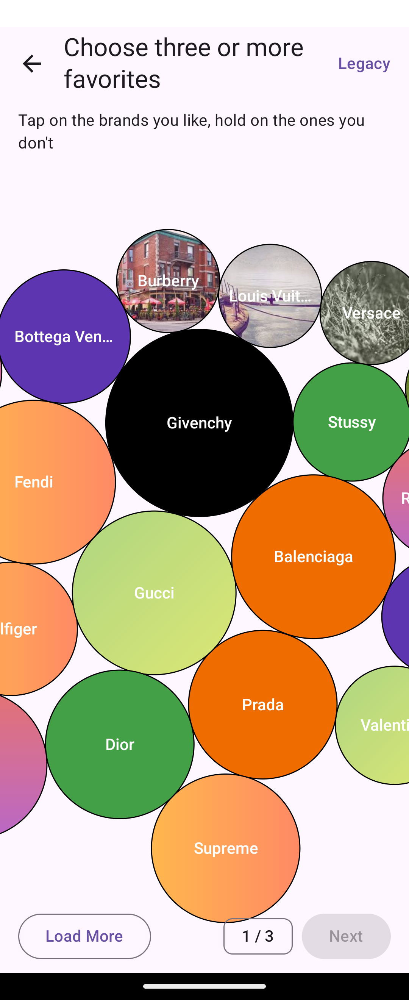

# ComposeBubblePicker

[](https://central.sonatype.com/artifact/io.github.dongnh311/compose-bubble-picker)
[](LICENSE)
[](#requirements)
[](https://kotlinlang.org)

A Compose-first bubble picker for Android: draggable, physics-driven bubbles
rendered with `Canvas` and a pure-Kotlin Position-Based Dynamics solver. No
OpenGL, no JBox2D, no third-party physics engine.

This library is a full rewrite inspired by
[`igalata/Bubble-Picker`](https://github.com/igalata/Bubble-Picker) (MIT).
No code is shared with the original; the UX concept and visual language are
the only inheritance.

<p align="center"></p>

## Requirements

- Android `minSdk` 21 · `compileSdk` / `targetSdk` 35
- Kotlin 2.1.x
- JVM target 17
- Compose BOM 2024.12.01+ (the library ships with its own Compose dependencies)

## Install

The library is published to Maven Central. Make sure `mavenCentral()` is in
your repositories:

```kotlin
// settings.gradle.kts
dependencyResolutionManagement {
    repositories {
        google()
        mavenCentral()
    }
}
```

Then depend on the library:

```kotlin
// app/build.gradle.kts
dependencies {
    implementation("io.github.dongnh311:compose-bubble-picker:1.0.0")
}
```

## Quick Start

```kotlin
@Composable
fun BrandPicker() {
    val items = remember {
        listOf(
            BubbleItem(id = 1, text = "Gucci", weight = 1.2f,
                gradient = BubbleGradient(
                    startColor = Color(0xFFE57373),
                    endColor = Color(0xFFBA68C8),
                )),
            BubbleItem(id = 2, text = "Prada", weight = 0.9f,
                backgroundColor = Color(0xFF1E88E5)),
            BubbleItem(id = 3, text = "Chanel", weight = 1f,
                backgroundImageUrl = "https://example.com/logo.png"),
        )
    }

    val state = rememberBubblePickerState(items = items)

    BubblePicker(
        state = state,
        modifier = Modifier.fillMaxSize(),
        onItemTap = { state.toggle(it.id) },
        onItemLongPress = { state.removeItem(it.id) },
    )
}
```

### Runtime mutations

```kotlin
state.addItem(BubbleItem(id = 99, text = "Fendi"))
state.addItems(listOf(/* ... */))
state.removeItem(id = 2)
state.clear()
state.select(id = 1)
state.deselectAll()
```

### Styling

```kotlin
BubblePicker(
    state = state,
    style = BubbleStyle(
        minRadius = 48.dp,
        maxRadius = 96.dp,
        selectedFill = Color.Black,
        selectedTextColor = Color.White,
        selectedScale = 1.2f,
        fontSize = 15.sp,
        imageOpacity = 0.8f,
    ),
)
```

## Migration from `igalata/Bubble-Picker`

| Before | After |
|---|---|
| `com.igalata.bubblepicker` | `com.dongnh.bubblepicker` |
| `BubblePicker` (`GLSurfaceView`) | `BubblePicker` (Composable) |
| `BubblePickerAdapter.getItem(pos)` | `List<BubbleItem>` passed to `rememberBubblePickerState` |
| `BubblePickerListener` | `onItemTap` / `onItemLongPress` lambdas |
| `PickerItem.gradient = BubbleGradient(0xFFRRGGBB, ...)` | `BubbleItem(gradient = BubbleGradient(Color(0xFFRRGGBB), ...))` |
| `picker.adapter = ...` / `onResume` / `onPause` | Stateless — just compose `BubblePicker(state)` |

`minSdk` is now 21 (was 16). The legacy API is still available under
`com.dongnh.bubblepicker.legacy` for XML-based apps that can't migrate yet.

## Legacy XML API

For projects that still need an XML-based component, the library ships an
`AbstractComposeView` wrapper:

```kotlin
import com.dongnh.bubblepicker.legacy.BubblePickerView
import com.dongnh.bubblepicker.legacy.BubblePickerAdapter
import com.dongnh.bubblepicker.legacy.BubblePickerListener
import com.dongnh.bubblepicker.legacy.PickerItem
```

All four types are marked `@Deprecated` with `ReplaceWith` hints pointing at
the Composable API. `PickerItem` keeps most of its original fields for source
compatibility, but the following are **accepted but not rendered in v1.0.0**:
`icon`, `iconOnTop`, `overlayAlpha`, `typeface`, `textSize`,
`showImageOnUnSelected`, `isViewBorderSelected`, `colorBorderSelected`,
`strokeWidthBorder`, `customData`. See [CHANGELOG.md](CHANGELOG.md).

## License

[Apache 2.0](LICENSE).
